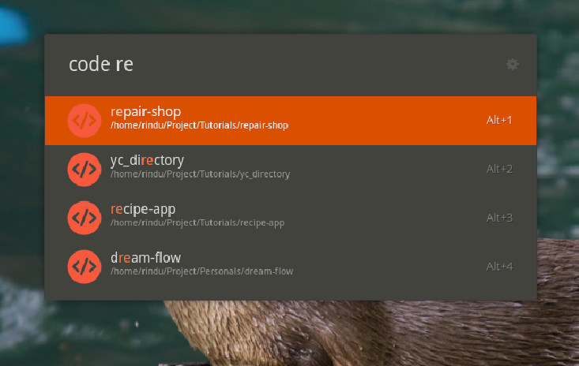
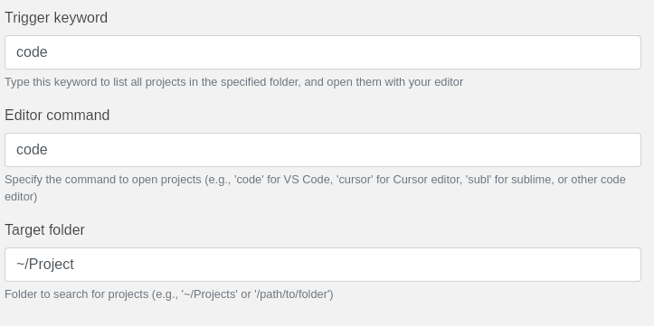

# Project Launcher Extension for Ulauncher



This Ulauncher extension helps you find your local projects from a specified folder and open them directly in your preferred editor. You can activate the extension using a specific keyword and view all projects in the given directory that are Git repositories.

## Installation

1. **Open Ulauncher settings**:
   - Launch Ulauncher (the default shortcut is `Ctrl + Space`).
   - Click the gear icon in the upper right to open Ulauncher settings.

2. **Add the extension**:
   - In the settings window, go to the **Extensions** tab.
   - Click the **Add Extension** button.
   - In the dialog that appears, paste the following URL:
     ```
     https://github.com/rinaldes/Project-Launcher.git
     ```
   - Click **Add** to install the extension.

Once the extension is installed, it will automatically be available for use.

## Setup

To configure the extension for your needs, follow these steps:

1. **Open Ulauncher settings** and go to the **Extensions** tab.
2. **Select the Project Launcher extension**.
3. **Adjust the following fields** in the configuration:

### Configuration Fields



#### 1. **Activation Keyword**
   - **Name**: `Trigger Keyword`
   - **Description**: This is the keyword you will type in Ulauncher to trigger the extension. It lists all your projects in the specified folder and opens them with your editor.
   - **Default value**: `code`
   
   **How to Use**: 
   - You can customize this keyword to any word or phrase you'd like. The default is `code`. This keyword will be used to activate the extension.

#### 2. **Editor Command**
   - **Name**: `Editor Command`
   - **Description**: This is the command used to open the selected project in your editor. For example, `code` for Visual Studio Code, `cursor` for the Cursor editor, `subl` for Sublime Text, or any other command you use to open your editor.
   - **Default value**: `code`
   
   **How to Use**: 
   - Set this to the command that opens your preferred editor from the terminal (e.g., `code` for VS Code). If you're using another editor, replace it with the appropriate command (e.g., `subl` for Sublime, `cursor` for Cursor).

#### 3. **Target Folder**
   - **Name**: `Target Folder`
   - **Description**: This is the folder where the extension will search for your Git repositories (projects). Set this to the root directory of where you store your projects, e.g., `~/Projects` or `/path/to/folder`.
   - **Default value**: `~/Project`
   
   **How to Use**: 
   - Set this to the path of the folder where you want the extension to search for Git repositories. The default value is `~/Project`, but you can change it to any directory where your projects are stored.

After making changes to the preferences, the extension will automatically apply them.

## Usage

1. **Open Ulauncher**:
   - The default shortcut to open Ulauncher is `Ctrl + Space`.

2. **Activate the extension**:
   - Type the **Activation Keyword** (default: `code`).
   - Press **Space** to trigger the search for your projects in the target folder.

3. **Search for projects**:
   - If you'd like to narrow down the results, type additional keywords after the activation keyword. For example, `code app` will show all projects containing the word "app" in their directory name.

4. **Open a project**:
   - Select the project from the list that appears. The extension will open the selected project in your preferred editor (e.g., Visual Studio Code, Cursor, Sublime, etc.).

## Example:

- **Step 1**: Press `Ctrl + Space` to open Ulauncher.
- **Step 2**: Type `code myproject` (assuming `code` is your activation keyword and `myproject` is part of your project name).
- **Step 3**: Select your project from the list that appears, and it will open in the editor you specified (e.g., VS Code).

## Troubleshooting

- **No Projects Found**:
  - If no projects are found, make sure the **Target Folder** path is correct and that the folder contains Git repositories. The extension only finds projects with a `.git` folder inside them.
