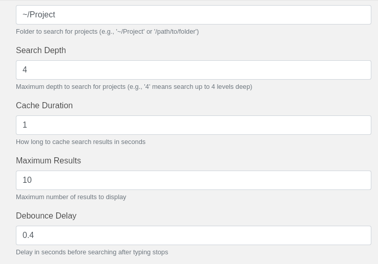

# Project Launcher for Ulauncher

A Ulauncher extension that helps you quickly find and open your Git projects. It searches through your specified directory for Git repositories and provides quick access to open them in your preferred editor.


## Features

- Fast project search with customizable debouncing
- Case-insensitive search
- Project caching with customizable duration
- Support for both `fd` and `find` commands
- Customizable search depth for finding repositories
- Configurable number of results to display
- Fully customizable through Ulauncher preferences

## Dependencies

### Required
- Python 3.x
- Ulauncher 5.x

### Recommended
- `fd-find` (much faster than `find`)
  ```bash
  # Fedora
  sudo dnf install fd-find

  # Ubuntu/Debian
  sudo apt install fd-find

  # Arch Linux
  sudo pacman -S fd

  # macOS
  brew install fd
  ```

## Installation

1. Open Ulauncher preferences
2. Go to "Extensions" tab
3. Click "Add extension"
4. Paste the following URL:
   ```
   https://github.com/rinaldes/Project-Launcher
   ```

## Configuration

The extension has several customizable preferences:


### Basic Settings
1. `folder`: The root directory to search for Git projects (e.g., `~/Projects`)
2. `editor`: Your preferred editor command (e.g., `code`, `cursor`, `windsurf`, `pearai`, `subl`)



### Advanced Settings
3. `search_depth`: Maximum directory depth to search for Git repositories (default: `4`)
4. `cache_duration`: How long to cache search results in seconds (default: `30`)
5. `max_results`: Maximum number of results to display (default: `10`)
6. `debounce_delay`: Delay in seconds before searching after typing stops (default: `0.4`)

## Usage

1. Open Ulauncher
2. Type your keyword (default: `code`) followed by a space
3. Start typing the project name
4. Select a project and press Enter to open it in your configured editor

## Performance Notes

- The extension uses caching (customizable, default 30 seconds) to avoid excessive filesystem searches
- Debouncing (customizable, default 400ms) is implemented to prevent too many searches while typing
- If `fd` is not available, it falls back to the standard `find` command
- Search depth is customizable (default 4 levels) for better performance
- You can adjust the cache duration and search depth based on your system's performance

## Customization Tips

- **Large Project Collections**: Increase `cache_duration` to reduce filesystem operations
- **Deep Project Structures**: Increase `search_depth` if your projects are nested deeply
- **Slow Systems**: Increase `debounce_delay` to reduce search frequency while typing
- **Many Projects**: Adjust `max_results` to show more or fewer projects in the results

## Troubleshooting

1. **Slow Search**: 
   - Install `fd-find` for better performance
   - Reduce `search_depth` if you have many directories
   - Increase `cache_duration` to reduce filesystem operations

2. **Projects Not Found**:
   - Make sure the project directory is set correctly in preferences
   - Verify that the projects have `.git` directories
   - Increase `search_depth` if your projects are nested deeply

3. **Editor Not Opening**:
   - Verify that your editor command is in your system PATH
   - Try using the full path to the editor in preferences
