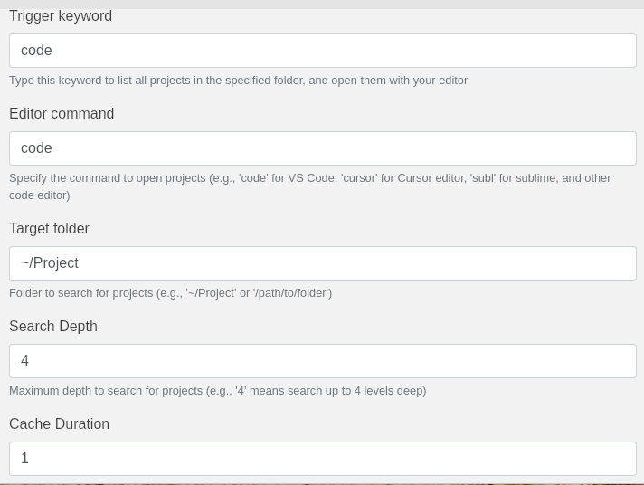

# Project Launcher for Ulauncher

A Ulauncher extension that helps you quickly find and open your Git projects. It searches through your specified directory for Git repositories and provides quick access to open them in your preferred editor.


## Features

- Fast project search with debouncing (400ms)
- Case-insensitive search
- Project caching for better performance (30s cache)
- Support for both `fd` and `find` commands
- Maximum search depth of 4 directories to keep things fast
- Shows up to 10 matching results

## Dependencies

### Required
- Python 3.x
- Ulauncher 5.x

### Recommended
- `fd-find` (much faster than `find`)
  ```bash
  # Fedora
  sudo dnf install fd-find

  # Ubuntu/Debian
  sudo apt install fd-find

  # Arch Linux
  sudo pacman -S fd

  # macOS
  brew install fd
  ```

## Installation

1. Open Ulauncher preferences
2. Go to "Extensions" tab
3. Click "Add extension"
4. Paste the following URL:
   ```
   https://github.com/rinaldes/Project-Launcher
   ```

## Configuration

The extension has two preferences that need to be set:



1. `folder`: The root directory to search for Git projects (e.g., `~/Projects`)
2. `editor`: Your preferred editor command (e.g., `code`, `cursor`, `windsurf`, `pearai`, `subl`)

## Usage

1. Open Ulauncher
2. Type your keyword (default: `code`) followed by a space
3. Start typing the project name
4. Select a project and press Enter to open it in your configured editor

## Performance Notes

- The extension uses caching (30 seconds) to avoid excessive filesystem searches
- Debouncing (400ms) is implemented to prevent too many searches while typing
- If `fd` is not available, it falls back to the standard `find` command
- Search depth is limited to 4 levels for better performance

## Troubleshooting

1. **Slow Search**: 
   - Install `fd-find` for better performance
   - Check if your project root directory isn't too deep
   - Verify you don't have too many nested Git repositories

2. **Projects Not Found**:
   - Make sure the project directory is set correctly in preferences
   - Verify that the projects have `.git` directories
   - Check if the projects are within 4 levels of your root directory

3. **Editor Not Opening**:
   - Verify that your editor command is in your system PATH
   - Try using the full path to the editor in preferences
